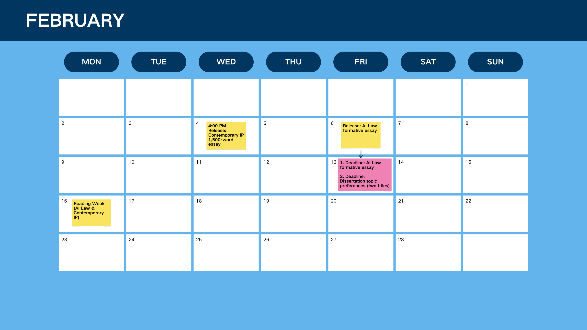
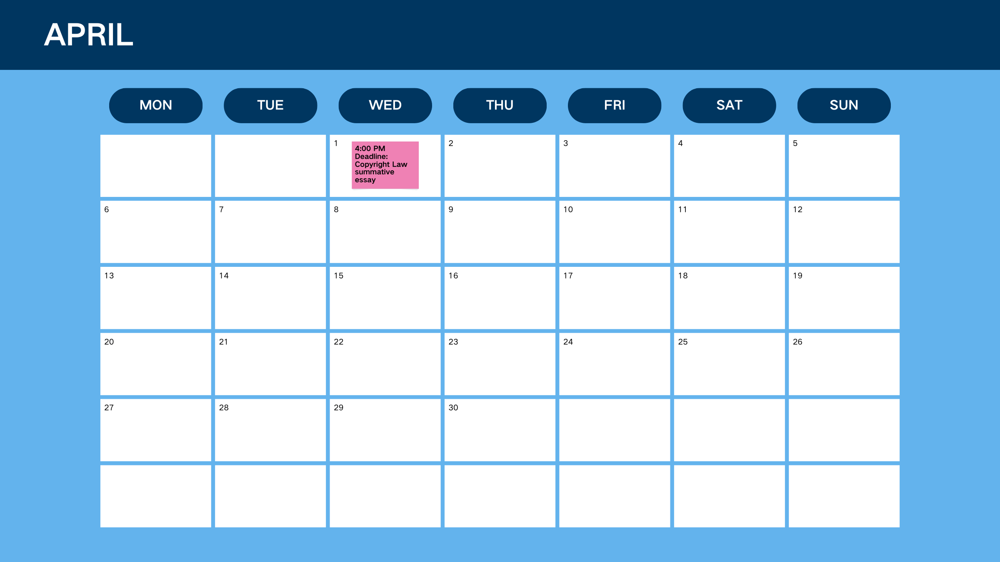

# Deadlines
## 1. January–April

## 2. May
May (all students; must be in May for international students in the UK on Student/Tier 4 visa): First supervision meeting

At least 3 days before the May meeting, and also stated as by the end of May: Research proposal to supervisor (before first meeting)

## 3. June
Before end of June (and must take place in June as an in-person/virtual meeting for international students in the UK on Student/Tier 4 visa): Second contact point

## 4. July
July (mandatory for international students in the UK on a Student/Tier 4 visa): Dissertation completion workshop

## 5. August
13 August 2026 at 4pm: Final dissertation submission deadline