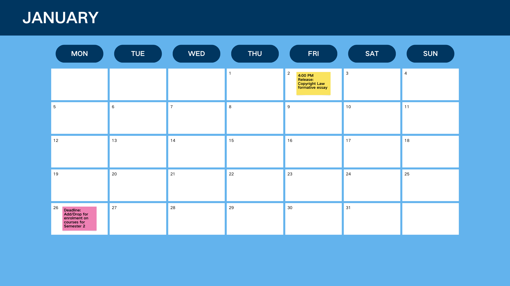
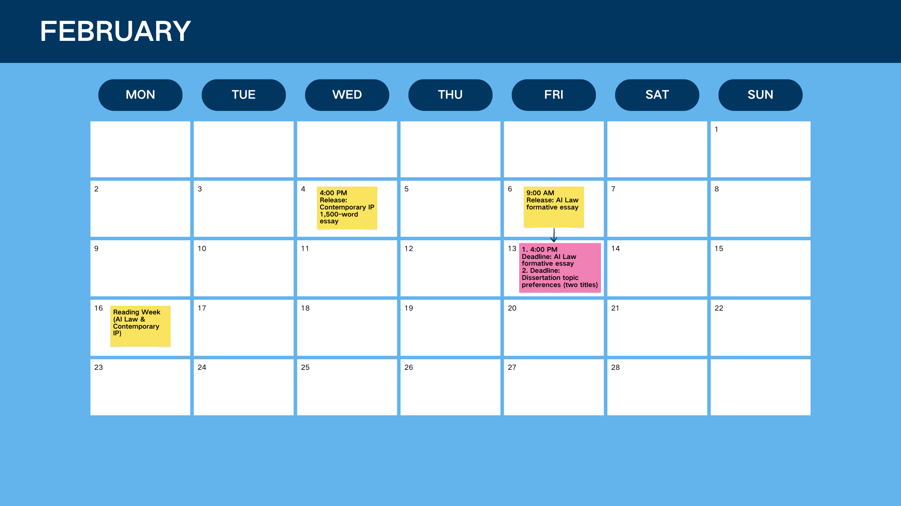
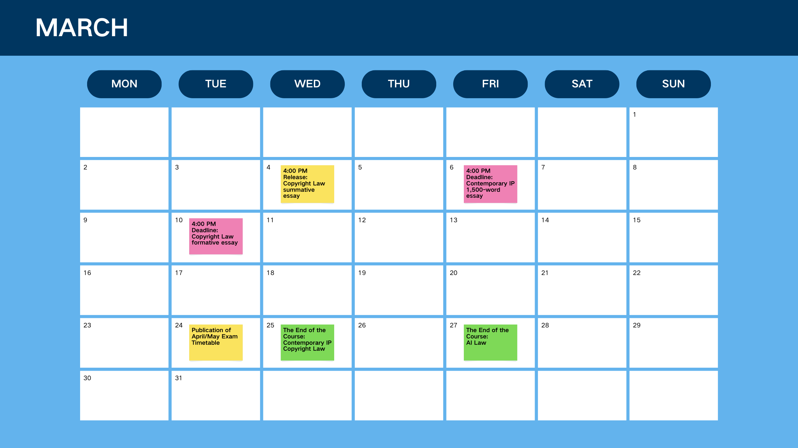
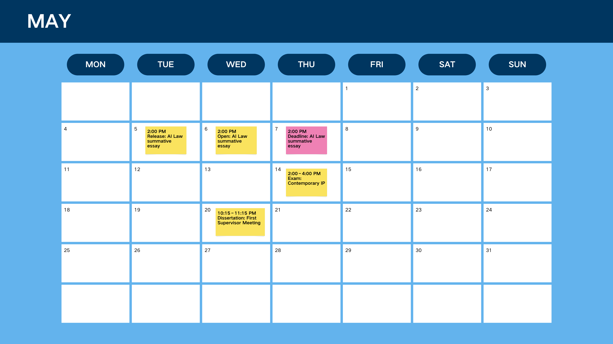

# Deadlines
## 1. January–May

## 2. June
Before end of June (and must take place in June as an in-person/virtual meeting for international students in the UK on Student/Tier 4 visa): Second contact point

## 3. July
July (mandatory for international students in the UK on a Student/Tier 4 visa): Dissertation completion workshop

## 4. August
13 August 2026 at 4pm: Final dissertation submission deadline